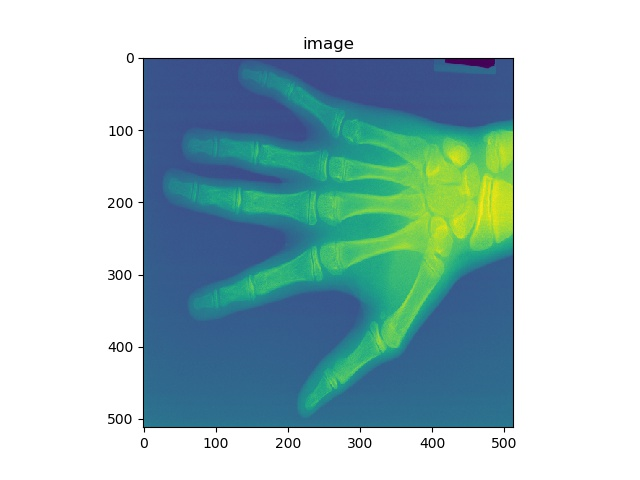
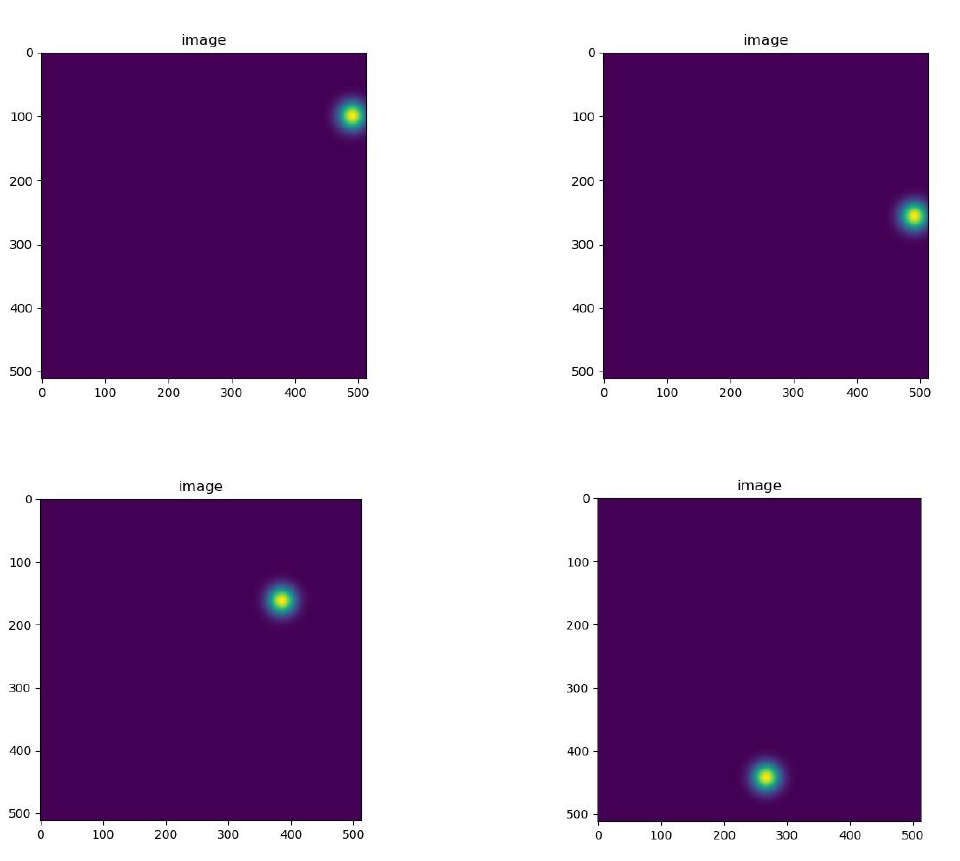
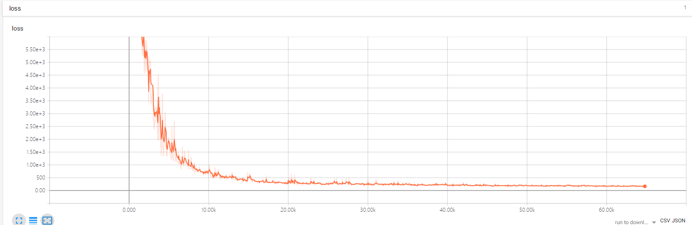
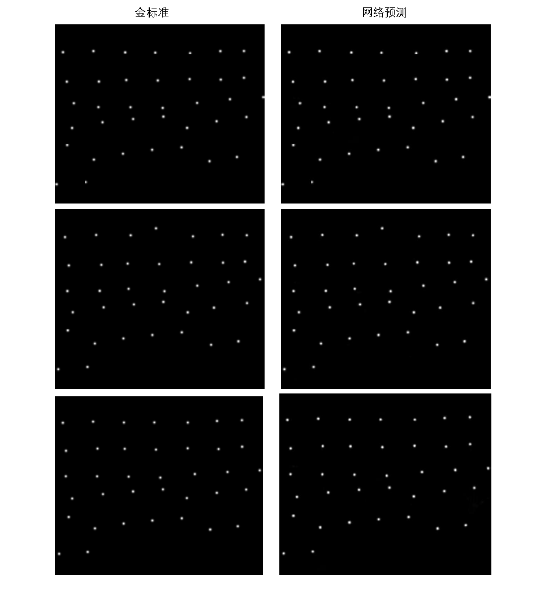

# LandMarksDetection
> This is an example of the X-ray hand landmarks detection

## Prerequisities
The following dependencies are needed:
- numpy >= 1.11.1
- SimpleITK >=1.0.1
- tensorflow-gpu ==1.8.0
- pandas >=0.20.1

## How to Use

**1、Preprocess**

* first,load image and landmark coords from csv,then resize to net input size,last generate landmarks heatmaps:run the data2dprepare.py
* image and landmarks heatmaps

* save image and mask into csv file: run the utils.py,like file traindetection.csv

**2、LandMarks Detection**

* the VNet model

## Result

* the train loss

* result

## Author

junqiangChen

## Contact
* https://github.com/junqiangchen
* email: 1207173174@qq.com
* Contact: junqiangChen
* WeChat Number: 1207173174
* WeChat Public number: 最新医学影像技术
